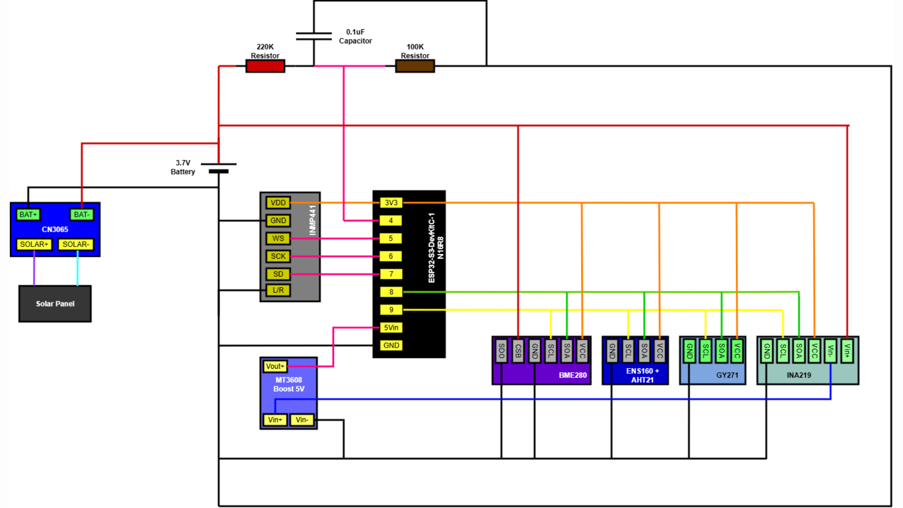
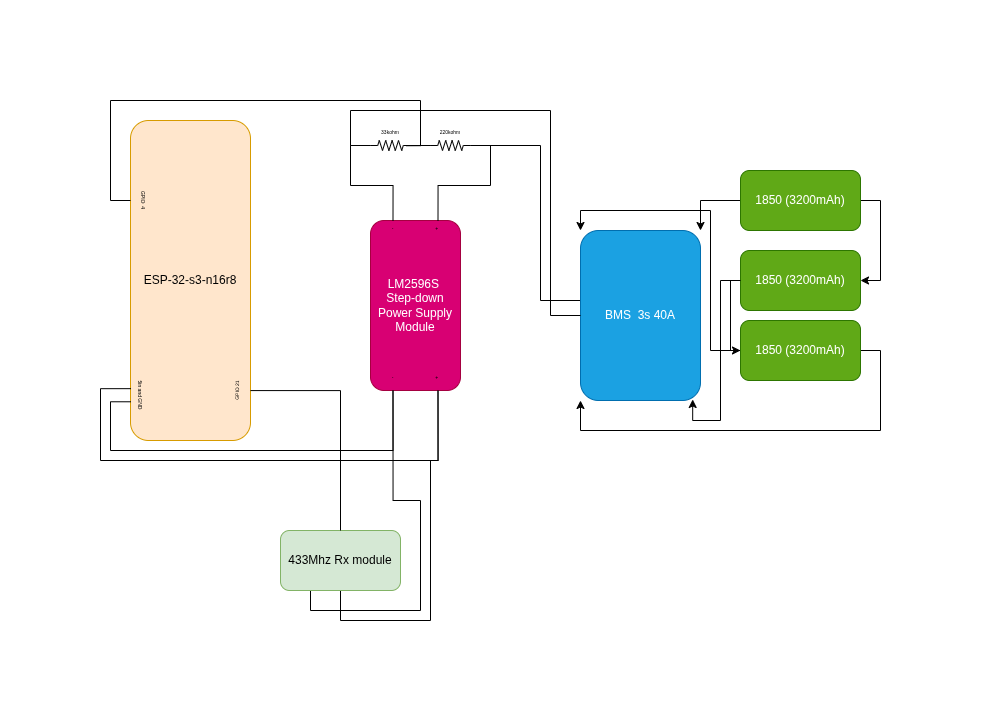

# WSN Main Set

This repository contains an ESP-IDF based wireless sensor network project for an `ESP32-S3` multi-sensor node. The main firmware lives in [ms_node](/home/punky/esp_1/esp_project/WSN_main_set/ms_node) and combines:

- BLE neighbor discovery and advertising
- ESP-NOW cluster communication
- STELLAR cluster-head election
- TDMA-style data collection windows
- Local SPIFFS storage with compression
- Optional UAV onboarding over Wi-Fi
- Optional RF trigger based onboarding

The code is written so the network can still run with missing sensors by falling back to mock sensor values where supported.

## Design Diagrams

### Complete MS Node Design



### Mock Data Generated MS Node Pipeline



## Project Structure

### Root

- [README.md](/home/punky/esp_1/esp_project/WSN_main_set/README.md): project overview and setup guide
- [assets](/home/punky/esp_1/esp_project/WSN_main_set/assets): project diagrams and reference images
  - [complete_ms_node_design.png](/home/punky/esp_1/esp_project/WSN_main_set/assets/complete_ms_node_design.png): complete MS node architecture/design view
  - [Mock_data_generated_ms_node.png](/home/punky/esp_1/esp_project/WSN_main_set/assets/Mock_data_generated_ms_node.png): mock-data driven system pipeline view
- [ms_node](/home/punky/esp_1/esp_project/WSN_main_set/ms_node): main ESP32-S3 firmware project

### `ms_node`

- [main](/home/punky/esp_1/esp_project/WSN_main_set/ms_node/main): application entry point and network behavior
  - `ms_node.c`: boot flow, task startup, sensor init, battery handling, main loop
  - `state_machine.*`: cluster state transitions
  - `metrics.*`: STELLAR metrics and scoring
  - `neighbor_manager.*`: neighbor tracking
  - `election.*`: cluster-head election
  - `ble_*`: BLE beacons, GATT configuration service, BLE management
  - `esp_now_manager.*`: ESP-NOW messaging
  - `persistence.*`: persisted state on SPIFFS
  - `led_manager.*`: onboard RGB status LED behavior
  - `auth.*`: authentication helpers

- [components](/home/punky/esp_1/esp_project/WSN_main_set/ms_node/components): reusable firmware modules
  - [sensors](/home/punky/esp_1/esp_project/WSN_main_set/ms_node/components/sensors): drivers for BME280, AHT21, ENS160, GY-271/HMC5883L, INA219, and INMP441
  - [battery](/home/punky/esp_1/esp_project/WSN_main_set/ms_node/components/battery): ADC-based battery voltage and percentage estimation
  - [pme](/home/punky/esp_1/esp_project/WSN_main_set/ms_node/components/pme): power mode engine
  - [storage_manager](/home/punky/esp_1/esp_project/WSN_main_set/ms_node/components/storage_manager): SPIFFS-backed storage, queueing, purge logic, chunk reads/writes
  - [compression](/home/punky/esp_1/esp_project/WSN_main_set/ms_node/components/compression): Huffman and `miniz` compression helpers
  - [rf_receiver](/home/punky/esp_1/esp_project/WSN_main_set/ms_node/components/rf_receiver): 433 MHz style trigger decoding through RMT
  - [uav_client](/home/punky/esp_1/esp_project/WSN_main_set/ms_node/components/uav_client): Wi-Fi + HTTP client for UAV onboarding/data upload

- [docs](/home/punky/esp_1/esp_project/WSN_main_set/ms_node/docs): design notes for timing, STELLAR, storage, data flow, sensors, and onboarding
- [tools](/home/punky/esp_1/esp_project/WSN_main_set/ms_node/tools): host-side Python utilities for log analysis and serial monitoring
- [managed_components](/home/punky/esp_1/esp_project/WSN_main_set/ms_node/managed_components): ESP component-manager dependencies pulled into the project
- [spiffs_data](/home/punky/esp_1/esp_project/WSN_main_set/ms_node/spiffs_data): files packaged into the SPIFFS partition at flash time
- [build](/home/punky/esp_1/esp_project/WSN_main_set/ms_node/build): generated build artifacts
- [logs](/home/punky/esp_1/esp_project/WSN_main_set/ms_node/logs): captured monitor logs
- [devices.yaml](/home/punky/esp_1/esp_project/WSN_main_set/ms_node/devices.yaml): local serial-port mapping for multi-node workflows
- [devices.example.yaml](/home/punky/esp_1/esp_project/WSN_main_set/ms_node/devices.example.yaml): example device mapping
- [flash_all.sh](/home/punky/esp_1/esp_project/WSN_main_set/ms_node/flash_all.sh): helper script for erasing, flashing, and monitoring three nodes
- [dependencies.lock](/home/punky/esp_1/esp_project/WSN_main_set/ms_node/dependencies.lock): locked ESP-IDF/component versions
- [partitions.csv](/home/punky/esp_1/esp_project/WSN_main_set/ms_node/partitions.csv): flash layout including factory app and SPIFFS storage

## Hardware Required

### Minimum hardware to flash and run

- 1 or more `ESP32-S3` boards
  - The project target is explicitly locked to `esp32s3`
  - The code assumes an onboard addressable RGB LED on `GPIO48`, which matches many ESP32-S3 DevKit boards
- USB data cable for each board
- Host machine with ESP-IDF installed

### Recommended hardware for a real multi-node setup

- 3 x `ESP32-S3` boards
  - The included [flash_all.sh](/home/punky/esp_1/esp_project/WSN_main_set/ms_node/flash_all.sh) script is written for three serial devices
- Li-ion/LiPo battery plus a voltage-divider battery sensing circuit
  - Firmware reads battery through `ADC1 channel 3`
  - Divider values in code: `R1 = 232k`, `R2 = 33k`

### Optional sensors supported by the firmware

These are initialized in code and can be enabled/disabled via runtime config:

- `BME280` over I2C at `0x76`
- `AHT21` over I2C at `0x38`
- `ENS160` over I2C at `0x53`
- `GY-271 / HMC5883L-compatible magnetometer` over I2C at `0x0D`
- `INA219` power monitor over I2C at `0x40`
- `INMP441` I2S microphone

### Pin mapping from the current code

- I2C bus
  - `SDA = GPIO8`
  - `SCL = GPIO9`
- INMP441 microphone
  - `WS = GPIO5`
  - `SCK = GPIO6`
  - `SD = GPIO7`
- Battery monitor
  - `ADC1 channel 3`
- Status LED
  - `GPIO48`
- RF onboarding receiver
  - `GPIO21`
  - Expected trigger code: `22`

### Optional UAV / RF onboarding hardware

- 433 MHz compatible RF receiver connected to `GPIO21` if you want hardware trigger based onboarding
- Wi-Fi access point or Raspberry Pi hotspot if you want to use the UAV onboarding flow
  - `uav_client` defaults around a `10.42.0.x` style gateway environment

## Software And Package Versions

Versions that are explicitly pinned in this repo:

- `ESP-IDF 5.3.4`
- Target: `esp32s3`
- Project version in lock file: `2.0.0`
- `espressif/cjson 1.7.19~1`
- `espressif/led_strip 3.0.3`

Host-side tools and packages used by the repo:

- `Python 3`
- `pyserial`
  - Required by several scripts in [ms_node/tools](/home/punky/esp_1/esp_project/WSN_main_set/ms_node/tools)
- `bash`
  - Used by [flash_all.sh](/home/punky/esp_1/esp_project/WSN_main_set/ms_node/flash_all.sh)

Note: this repo does not currently include a pinned `requirements.txt` for the Python utilities, so `pyserial` is a documented dependency rather than a locked one.

## Flash Layout

The firmware uses a custom partition table:

- `nvs` at `0x9000`
- `phy_init` at `0xF000`
- `factory` app at `0x10000` with size `0x200000`
- `storage` SPIFFS partition at `0x210000` with size `0xC00000`

`spiffs_data` is packaged into the `storage` partition during build.

## Compression Decision

The repository contains two compression implementations inside [ms_node/components/compression](/home/punky/esp_1/esp_project/WSN_main_set/ms_node/components/compression):

- `lz_miniz.c`: `miniz` based DEFLATE compression
- `huffman.c`: byte-wise Huffman compression

### How to choose the better algorithm using real data

To choose properly, compare both algorithms on real payloads produced by this project, not only on small manual samples. The useful measurements are:

- compression ratio on real JSON sensor payloads
- compression time on the `ESP32-S3`
- decompression time on the `ESP32-S3`
- RAM and PSRAM usage during compression and decompression
- whether the algorithm works cleanly with SPIFFS storage, CH forwarding, and UAV offload

The best real-data test set for this repo is:

- sensor JSON payloads generated by the running nodes
- stored MSLG records from `/spiffs/data.lz`
- cluster-head aggregated payloads after multi-node runs

### Chosen algorithm in the current codebase

The current end-to-end system uses `miniz/deflate` as the chosen compression algorithm.

Why `miniz` is the better fit for this repo right now:

- `storage_manager_write_compressed()` compresses with `lz_compress_miniz()`
- `storage_manager_read_all_decompressed()` restores data with `lz_decompress_miniz()`
- the ESP-NOW and offload paths also expect the `miniz` decode path
- the MSLG header currently defines `algo = 0` for raw and `algo = 1` for `miniz(deflate)`
- compression is only used when payloads are at least `1024` bytes and save more than `5%`
- the configured compression level is `3`, which is the balanced production setting in this repo

Huffman is implemented and available for experiments, but it is not wired into the deployed storage format or the full CH/UAV pipeline today. Because of that, `miniz` is the correct documented choice for the real running system.

### Recommendation for future real-data comparison

If you want to compare `miniz` and `Huffman` with actual node output:

1. collect real payloads from deployed or bench-tested nodes
2. run both codecs on the same payload corpus
3. compare size reduction, encode/decode time, and memory cost
4. keep `miniz` as the production path unless the full MSLG read/write/offload pipeline is updated for Huffman too

## Real System Pipeline

The real system pipeline currently used in the codebase is:

1. real sensors or mock data generate readings
2. the main loop builds a JSON payload with node state and sensor values
3. `storage_manager_write_compressed(..., true)` stores the payload into `/spiffs/data.lz`
4. `miniz` compression is applied only when the data is large enough and saves enough space
5. during the DATA phase, stored chunks are popped from SPIFFS
6. compressed chunks are decompressed before forwarding
7. members send data to the cluster head over ESP-NOW
8. the cluster head stores both its own data and member data in the same MSLG pipeline
9. the UAV/offload path reads the stored data back in decompressed form and uploads it over Wi-Fi/HTTP

### Mock-data design and real-data system

The diagram [Mock_data_generated_ms_node.png](/home/punky/esp_1/esp_project/WSN_main_set/assets/Mock_data_generated_ms_node.png) is still a valid representation of the real system pipeline because the downstream flow is the same:

- mock data and real sensor data both enter the same JSON generation path
- both use the same MSLG storage format
- both go through the same compression decision logic
- both follow the same ESP-NOW cluster transport path
- both use the same CH aggregation and UAV offload flow

So the main difference is only the source of the readings at the start of the pipeline. The rest of the pipeline remains the same.

### Real pipeline test guidance

To test the chosen compression algorithm in the full real system:

1. run at least a 3-node setup
2. attach real sensors where available, or mix real and mock nodes if needed
3. let the nodes accumulate enough data to pass the `1024` byte compression threshold
4. capture logs in [ms_node/logs](/home/punky/esp_1/esp_project/WSN_main_set/ms_node/logs)
5. verify that chunks are written to `/spiffs/data.lz`, popped, decompressed, transmitted, stored by the CH, and uploaded without CRC or decompression failures
6. use the same recorded payload corpus if you want to benchmark Huffman offline against the chosen `miniz` path

## What The Firmware Does

At boot, the node:

1. Initializes NVS, authentication, metrics, persistence, BLE, LED, storage, network stack, ESP-NOW, RF receiver, and the cluster state machine.
2. Loads sensor configuration from NVS.
3. Starts sensor drivers and battery monitoring.
4. Runs STELLAR-based clustering and periodic metrics updates.
5. Stores sensor data locally in SPIFFS and exchanges data during scheduled network phases.

The main loop is designed to continue operating even if some sensors are absent. The code enables mock sensor behavior so development and clustering can still proceed without the full sensor stack attached.

## Build And Flash

### Prerequisites

- ESP-IDF `5.3.4` environment installed and exported
- Target set to `esp32s3`
- Serial ports known for each board

### Build

Run from [ms_node](/home/punky/esp_1/esp_project/WSN_main_set/ms_node):

```bash
idf.py set-target esp32s3
idf.py build
```

### Flash one board

```bash
idf.py -p /dev/ttyACM0 flash monitor
```

Replace the serial port with the one for your system, for example:

- Linux: `/dev/ttyACM0`, `/dev/ttyUSB0`
- macOS: `/dev/cu.usbmodem*`
- Windows: `COM3`

### Flash three boards

Edit [ms_node/flash_all.sh](/home/punky/esp_1/esp_project/WSN_main_set/ms_node/flash_all.sh) or [ms_node/devices.yaml](/home/punky/esp_1/esp_project/WSN_main_set/ms_node/devices.yaml) for your ports, then run:

```bash
cd ms_node
bash flash_all.sh
```

The script currently:

- erases three predefined ports
- flashes firmware to those ports
- starts three serial monitor sessions and writes logs into [ms_node/logs](/home/punky/esp_1/esp_project/WSN_main_set/ms_node/logs)

## Useful Tools

From [ms_node/tools](/home/punky/esp_1/esp_project/WSN_main_set/ms_node/tools):

- `quick_monitor.py`: quick serial log viewer
- `monitor_ch_rx.py`: observe whether the cluster head is receiving member data
- `verify_stellar.py`: monitor STELLAR-related log output
- `check_seq_order.py`: validate payload sequence ordering from logs
- `analyze_ap.py`: ad hoc analysis script for captured sequence behavior

Example:

```bash
python3 tools/quick_monitor.py /dev/ttyACM0 20
```

## Notes For Development

- Sensor configuration is stored in NVS and reloaded at runtime.
- Audio sensing is disabled by default in the config because it is higher power.
- Storage manager auto-purges when SPIFFS usage exceeds `90%`.
- The codebase includes generated folders such as `build/` and local editor/cache folders that are not the source of truth.
- There are extra design details in [ms_node/docs](/home/punky/esp_1/esp_project/WSN_main_set/ms_node/docs) if you need timing diagrams or architecture notes.

## Current Verified Versions Summary

- Firmware project: `ms_node`
- ESP-IDF: `5.3.4`
- Target chip: `ESP32-S3`
- Managed components:
  - `espressif/cjson 1.7.19~1`
  - `espressif/led_strip 3.0.3`
- Default monitor baud in device config: `115200`
