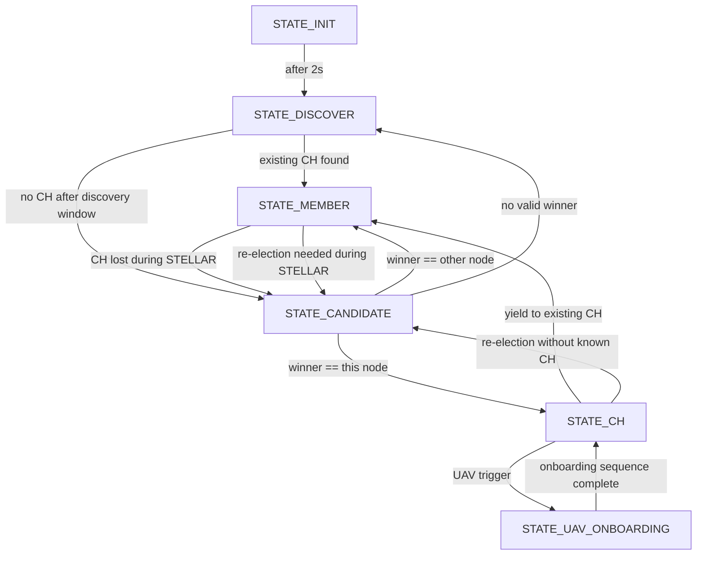
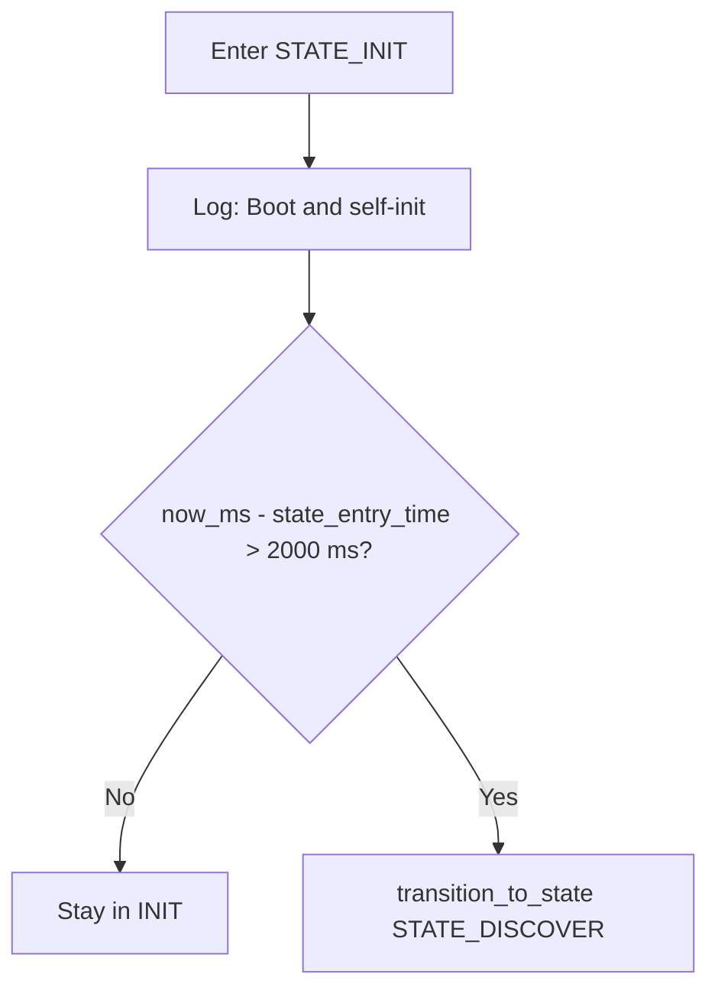
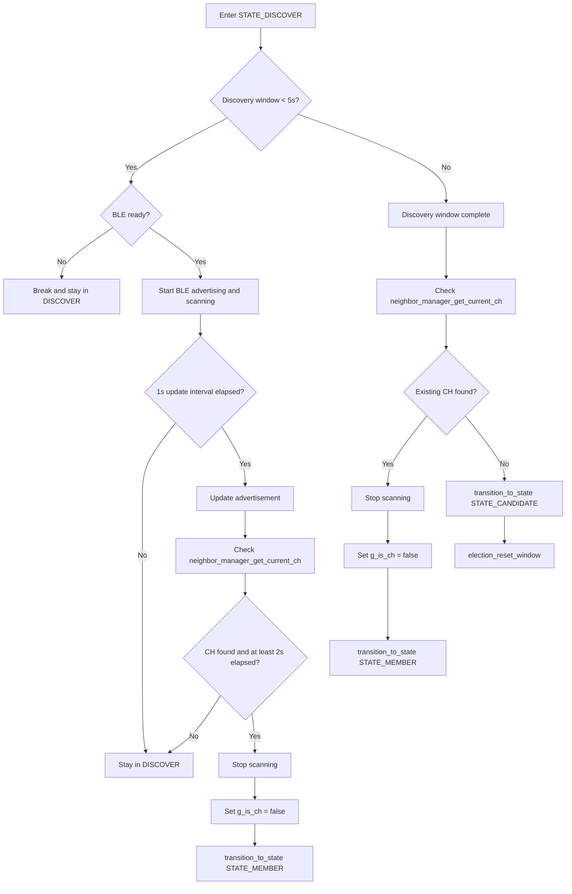
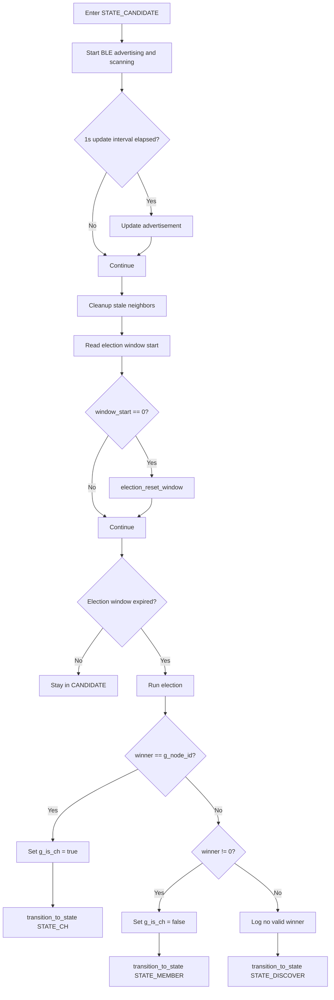
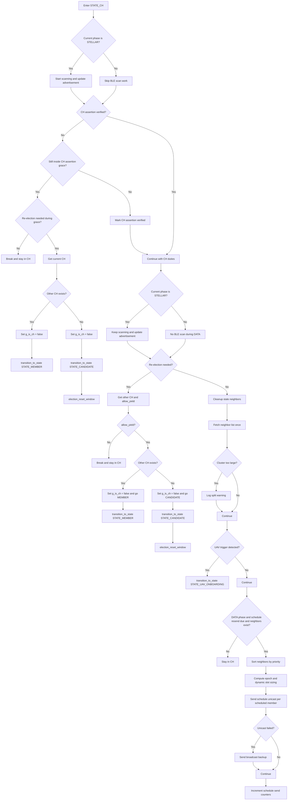
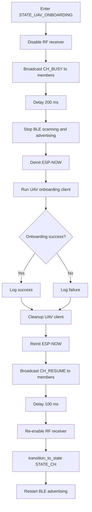
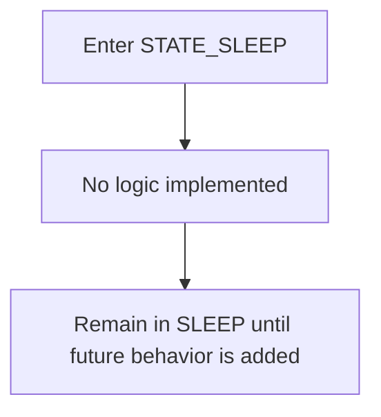

# State Machine Flowchart

> Visual guide to the `g_current_state` switch in `main/state_machine.c`

---

## Overview

This document summarizes the runtime state machine handled by `state_machine_run()`.
It focuses on the high-level decision flow for each state:

- `STATE_INIT`
- `STATE_DISCOVER`
- `STATE_CANDIDATE`
- `STATE_CH`
- `STATE_MEMBER`
- `STATE_UAV_ONBOARDING`
- `STATE_SLEEP`

The diagrams below are derived from the current logic in `main/state_machine.c`.

---

## Global State Transition Map

---

## STATE_INIT

Purpose: boot stabilization and a short startup delay before discovery begins.

Notes:

- BLE readiness is intentionally not required here.
- The only exit path is the 2-second timeout to `STATE_DISCOVER`.

---

## STATE_DISCOVER

Purpose: discover nearby nodes and join an existing cluster if a CH is already present.

Notes:

- During discovery, the node both advertises and scans.
- Early join is allowed after 2 seconds if a CH is detected.
- If no CH is found by the end of the 5-second window, the node becomes a candidate.

---

## STATE_CANDIDATE

Purpose: advertise score data, collect neighbor information, and run election.

Notes:

- `transition_to_state(STATE_CH)` also resets CH assertion tracking.
- If election returns no valid winner, the node restarts from discovery.

---

## STATE_CH

Purpose: operate as cluster head, defend CH ownership, manage members, and schedule TDMA slots.

Notes:

- CH conflict resolution is phase-aware: normal yielding is preferred in `PHASE_STELLAR`, while `PHASE_DATA` only yields immediately if another CH is already known.
- TDMA schedule sends are only performed during `PHASE_DATA`.
- CH self-storage is no longer done in this state handler; it now happens in `ms_node.c`.

---

## STATE_MEMBER

Purpose: follow the CH, maintain BLE behavior by phase, receive TDMA schedule assignments, and drain local MSLG data during assigned slot windows.

```mermaid
flowchart TD
    A[Enter STATE_MEMBER] --> B{Current phase is STELLAR?}

    B -->|Yes| C[Compute elapsed time in superframe]
    C --> D{Inside BLE pre-guard window?}
    D -->|Yes| E[Stop BLE scan and advertising]
    E --> F[Pin WiFi radio to ESP-NOW channel]
    F --> G[Set pre-guard active]
    D -->|No| H[Clear pre-guard active]
    H --> I[Start BLE scanning]

    B -->|No| J[Skip BLE scanning during DATA]

    G --> K
    I --> K
    J --> K

    K{BLE advertising not started and phase is STELLAR?}
    K -->|No| L[Continue]
    K -->|Yes| M{BLE ready?}
    M -->|No| N[Log wait and break]
    M -->|Yes| O[Start advertising and set member_ble_started]
    O --> L

    L --> P{Current phase is STELLAR?}
    P -->|Yes| Q[Check current CH beacon]
    Q --> R{Current CH found?}
    R -->|No| S[Increment CH miss count]
    S --> T{Miss threshold reached?}
    T -->|Yes| U[Reset member flags]
    U --> V[transition_to_state STATE_CANDIDATE]
    V --> W[election_reset_window]
    T -->|No| X[Log wait and continue]
    R -->|Yes| Y[Reset CH miss count]
    P -->|No| Z[Suspend beacon timeout during DATA]

    X --> AA
    Y --> AA
    Z --> AA

    AA --> AB{STELLAR phase and adv update due?}
    AB -->|Yes| AC{BLE ready?}
    AC -->|Yes| AD[Update advertisement]
    AC -->|No| AE[Skip update]
    AB -->|No| AF[Continue]
    AD --> AF
    AE --> AF

    AF --> AG[Cleanup stale neighbors]
    AG --> AH{STELLAR phase and re-election needed?}
    AH -->|Yes| AI[Reset member flags]
    AI --> AJ[transition_to_state STATE_CANDIDATE]
    AJ --> AK[election_reset_window]
    AH -->|No| AL[Continue]

    AL --> AM[Read current TDMA schedule]
    AM --> AN{Schedule valid?}
    AN -->|Yes| AO[Evaluate slot window]
    AO --> AP{Inside own slot and >2s since last send?}
    AP -->|Yes| AQ[Set can_send = true]
    AP -->|No| AR[Track window state only]
    AN -->|No| AS{Current phase is DATA?}
    AS -->|Yes| AT[Warn once: waiting for TDMA schedule]
    AS -->|No| AU[Continue]

    AQ --> AV
    AR --> AV
    AT --> AV
    AU --> AV

    AV --> AW{Current phase is DATA?}
    AW -->|No| AX[Force can_send = false]
    AW -->|Yes| AY[Continue]

    AX --> AZ
    AY --> AZ

    AZ --> BA{CH busy with UAV onboarding?}
    BA -->|Yes| BB[Log hold and block sends]
    BA -->|No| BC[Resume sending if needed]
    BB --> BD
    BC --> BD

    BD --> BE[Cache CH MAC during STELLAR when available]
    BE --> BF[Resolve CH MAC: live lookup or DATA-phase cache]
    BF --> BG{can_send and valid schedule?}
    BG -->|Yes| BH[Update last_data_send]
    BG -->|No| BI[Continue]

    BH --> BJ
    BI --> BJ

    BJ --> BK[Re-read schedule and compute in_slot and slot_end]
    BK --> BL{DATA phase and in_slot and CH available?}
    BL -->|No| BM[Skip burst drain]
    BL -->|Yes| BN[Pop MSLG chunks in batch]
    BN --> BO{Chunk available and time budget remains?}
    BO -->|No| BP[Stop or requeue remaining]
    BO -->|Yes| BQ{Chunk compressed?}
    BQ -->|Yes| BR[Decompress]
    BQ -->|No| BS[Use raw chunk]
    BR --> BT{Decompress OK?}
    BT -->|No| BU[Requeue remaining and stop]
    BT -->|Yes| BV[Fast-send chunk to CH]
    BS --> BV
    BV --> BW{Send OK?}
    BW -->|Yes| BX[Count sent chunk and continue batch]
    BW -->|No| BY[Requeue this and remaining chunks]
    BX --> BO
    BP --> BZ[Optional fallback history sync path]
    BU --> BZ
    BY --> BZ
    BM --> BZ
```

Notes:

- `STATE_MEMBER` is strongly phase-aware:
  - `PHASE_STELLAR`: BLE scan/advertise, CH beacon validation, possible re-election.
  - `PHASE_DATA`: BLE quiet, TDMA schedule use, MSLG burst drain to CH.
- If no schedule is available, the node buffers data and waits instead of transmitting blindly.
- During UAV onboarding, members pause sends when they receive CH busy status.

---

## STATE_UAV_ONBOARDING

Purpose: temporarily suspend normal STELLAR operation so the CH can offload stored data to a UAV over WiFi STA.

Notes:

- This path is initiated only from `STATE_CH`.
- The state returns to `STATE_CH` regardless of onboarding success or failure.
- Members are explicitly told to hold data during this interval using `CH_BUSY`.

---

## STATE_SLEEP

Purpose: reserved placeholder for future implementation.

Notes:

- The branch currently contains only a comment and `break`.
- There is no active transition into or out of `STATE_SLEEP` in the shown flow.

---

## Transition Helper Behavior

`transition_to_state()` also performs side effects that matter when reading the charts:

- Entering `STATE_CH`:
  - sets `g_is_ch = true`
  - resets `ch_assertion_verified`
  - starts `ch_assertion_start`
- Entering `STATE_MEMBER`:
  - sets `g_is_ch = false`
  - resets `member_ble_started`
  - resets `s_pre_guard_active`
  - resets `ch_miss_count`
- Every state transition:
  - updates `g_current_state`
  - updates LED state via `led_manager_set_state()`
  - resets `state_entry_time`

---

## Source Reference

- Main implementation: `main/state_machine.c`
- State enum: `main/state_machine.h`
